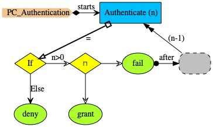

# Authentication

A PC authentication involving a number of tries (parameter <i>n</i>). If there are no tries left, then event <i>deny</i> happens to signal the fact that authentication failed. If there are tries left then authentication may either be successful (<i>grant</i>) or simply <i>fail</i>, in which case a user may have another try, if there are tries left.

