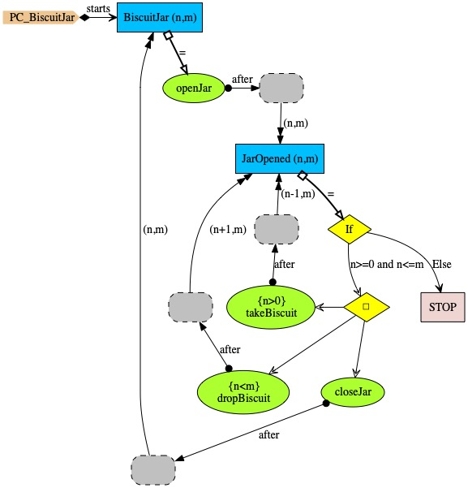

# Biscuit Jar
A PC of a biscuit jar, which:
* When the jar's lid is taken off (event <i>openJar</i>),
biscuits may be taken (event <i>takeBiscuit</i>) or dropped (event <i>dropBiscuit</i>).
* Variable <i>n</i> holds number of biscuits inside the jar, and <i>m</i> holds maximum number of biscuits that jar can hold.

