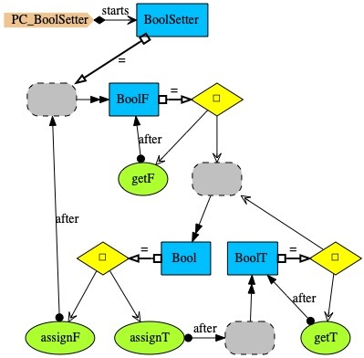

# BoolSetter

<i>Bool setter</i> is an example taken from [Hoa85]. In this version, there is an initial value assignment to <i>False</i>.

### References

[Hoa85] Anthony Hoare. Communicating Sequential Processes. Prentice-Hall International. 1985.
