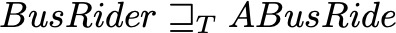

The <i>Bus Rider</i> PCs example, which describes the actions of a bus passenger. PC <i>PC_ABusRide</i> describes a more concrete process. We have that: , that is process <i>ABusRide</i> refines <i>BusRider</i>, which can be confirmed by running the CSP file 'PC_ABusRide_analysis.csp' on CSP refinement checker FDR4.
