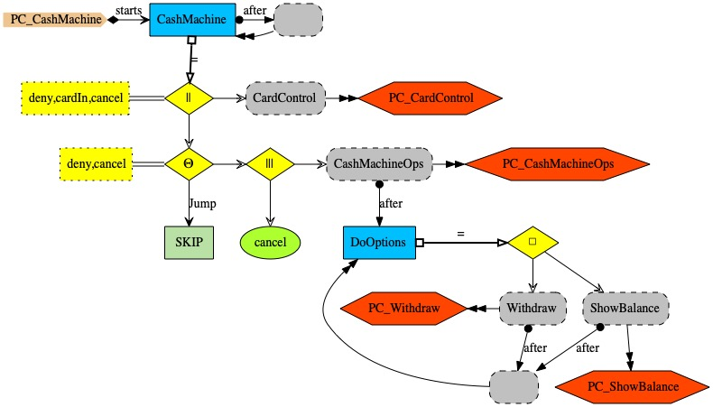
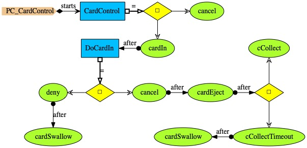

# Cash machine

The PCs description of a cash machine comprises several constituent PCs. <i>PC_CashMachine</i> (above) gives overall description. <i>CashMachine</i> is a process which keeps running (process cash machine is followed by itself). Body of <i>CashMachine</i> puts together <i>CardControl</i> and another throw operator
using a parallel composition operator which synchronises on events <i>deny</i>, <i>cardIn</i> and <i>cancel</i>. The throw operator executes an interleaving operator and says that there is a jump to <i>SKIP</i> upon events <i>deny</i> and <i>cancel</i>, which means that if the authentication is denied or the customer decides to cancel the cash machine operations then no further action is taken. The interleaving operator says that <i>cancel</i> may happen at any time, and executes <i>CashMachineOps</i> followed by <i>DoOptions</i>;  <i>DoOptions</i> is executed provided the cash machine customer passes the security  authentication control &mdash; otherwise <i>deny</i>  would happen and the throw operator would cause <i>SKIP</i>. <i>DoOptions</i> offers the choice of <i>Withdraw</i> and <i>ShowBalance</i>.

<i>PC_CardControl</i> introduces process <i>CardControl</i>, which manages the card inserted into the cash machine. <i>CardControl</i> offers the external choice of <i>cancel</i> and <i>cardIn</i>; <i>cancel</i> results in the graceful end of <i>CardControl</i>. Event <i>cardIn</i> triggers process <i>DoCardIn</i>, which expects either a <i>deny</i>, which results in the card being swallowed as the customer failed all tries of authentication, or a <i>cancel</i> (a customer requests the end of the cash machine interaction), which results in the card being ejected; once the card is ejected, the customer may either collect it within the specified timeout or he may forget to collect the card, in which case the machine swallows the card for security reasons.

* <i>PC_CashMachineOps</i> describes the commencement of the cash machine operations. <i>CashMachineOps</i> expects the card to be inserted into the machine's slot, which starts the authentication procedure.
* <i>PC_Authentication</i> describes authentication through a number of tries (parameter <i>n</i>).
If there are no tries left, then event <i>deny</i> happens as authentication failed. If there are tries left then authentication may either be successful (<i>grant</i>) or simply <i>fail</i>, in which case a user may have another try, if there are tries left.
* <i>PC_Withdraw</i> says that upon <i>withdraw</i> the cash may be collected, or the request may be denied (event <i>cashDeny</i>) due to insufficient funds or because the machine is unable to give out that amount.
* <i>PC_ShowBalance</i> says that the balance is shown to the customer (event <i>showBalance</i>).
