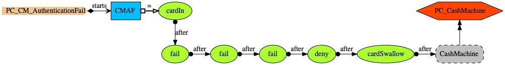

# Cash machine

The PCs description of a cash machine (CM) comprises several constituent PCs. <i>PC_CashMachine</i> (above) gives overall description. <i>CashMachine</i> is a process which keeps running (process cash machine is followed by itself). Body of <i>CashMachine</i> puts together <i>CardControl</i> and another throw operator
using a parallel composition operator which synchronises on events <i>deny</i>, <i>cardIn</i> and <i>cancel</i>. The throw operator executes an interleaving operator and says that there is a jump to <i>SKIP</i> upon events <i>deny</i> and <i>cancel</i>, which means that if the authentication is denied or the customer decides to cancel the CM operations then no further action is taken. The interleaving operator says that <i>cancel</i> may happen at any time, and executes <i>CashMachineOps</i> followed by <i>DoOptions</i>;  <i>DoOptions</i> is executed provided the cash machine customer passes the security  authentication control &mdash; otherwise <i>deny</i>  would happen and the throw operator would cause <i>SKIP</i>. <i>DoOptions</i> offers the choice of <i>Withdraw</i> and <i>ShowBalance</i>.

<i>PC_CardControl</i> manages the card inserted into the CM. <i>CardControl</i>, the starting process, offers the external choice of <i>cancel</i> and <i>cardIn</i>:
* <i>cancel</i> results in the graceful end of <i>CardControl</i>.
* Event <i>cardIn</i> triggers process <i>DoCardIn</i>, which expects either a <i>deny</i>, which results in the card being swallowed as the customer failed all tries of authentication, or a <i>cancel</i> (a customer requested the end of the cash machine interaction), which results in the card being ejected; once the card is ejected, the customer may either collect it within the specified timeout or he may forget to collect the card, in which case the machine swallows the card for security reasons.

 

<i>PC_CashMachineOps</i> describes the commencement of the CM operations. <i>CashMachineOps</i> expects the card to be inserted into the machine's slot, after which the authentication procedure is started.

<i>PC_Authentication</i> describes an authentication process with a number of tries (parameter <i>n</i>).
If there are no tries left, then event <i>deny</i> happens as authentication failed. If there are tries left then authentication may either be successful (<i>grant</i>) or simply <i>fail</i>, in which case a user may have another try, if there are tries left.

 

<i>PC_Withdraw</i> says that upon <i>withdraw</i> the cash may be collected, or the request may be denied (event <i>cashDeny</i>) due to insufficient funds or because the machine is unable to give out that amount.

<i>PC_ShowBalance</i> says that the balance is shown to the customer (event <i>showBalance</i>).

## Scenario-based Model Analysis

The scenario-based analysis that follows tries to ascertain whether CM's model expresses what is intended. Each scenario is accompanied by a CSP assertion which checks the scenario's validity and whose satisfaction can be checked using the FDR4 refinement checker.

PC <i>PC_CM_AuthenticationFail</i> describes a scenario in which
an authentication fails three times; after which, the card is swallowed for security reasons. The validity is confirmed by the CSP tool (see CSP file 'PC_CM_Analysis1.csp'), hence: CashMachine &#x2291;T CMAF.

PC <i>PC_CM_2FailsCancel</i> describes an authentication which fails twice, after which the CM interaction is cancelled and the card is ejected and collected.  The scenario is valid, hence: CashMachine &#x2291;T CM2FsC (see CSP file 'PC_CM_Analysis2.csp').

PC <i>PC_CM_OkWithdraw</i> describes a successful authentication followed by a cash withdrawal &mdash; CashMachine &#x2291;T CMOkWithdraw (see CSP file 'PC_CM_Analysis3.csp').

PC <i>PC_CM_OkBalanceForget</i> describes
a successful authentication, followed by a balance consultation, but the card is forgotten as it is not collected within the allowed time &mdash; CashMachine &#x2291;T CMOkBalanceForget (see CSP file 'PC_CM_Analysis4.csp').

PC <i>PC_CM_InvalidWithdraw</i> describes an invalid scenario: an authentication which fails twice, followed by a successful cash withdrawal &mdash; an invalid scenario; hence: CashMachine &#x22E2;T CMInvalidWithdraw (see CSP file 'PC_CM_Analysis5.csp').

## Security verification

PC <i>PC_CM_InvalidWithdraw</i> describes a violation of security not accepted by the modelled CM. The interesting question to answer is: is it possible to overcome the authentication security defence in CM?

To answer this question, PC PC_CMBarred describes authentication's security expectation in terms of a <i>BarredAsset</i>, instantiated for CM
as <i>CMBarred</i>. Protected events (set <i>pes</i>, atom <i>protected</i>) may happen only after the barrier lifting events (set <i>bes</i>) occur (atom <i>erect</i>); before the lifting, only events in sets <i>ses</i> (start events), <i>rses</i> (re-start events) and <i>oes</i> (other events) may occur; after the lifting both <i>pes</i> and <i>oes</i> events are allowed to happen. In CM, <i>optWithdraw</i> and <i>showBalance</i> are protected events, <i>grant</i> lifts the barrier.

Authentication is verified to be effective in CM as:
* CMBarred &#x2291;T CashMachine (see CSP file 'PC_CM_Analysis6.csp'). This means that the cash machine satisfies the expectations of a barred asset.

On the other hand, we have that <i>CMBarred</i>  disallows scenarios in which account operations are carried out without a prior authentication check:  
* CMBarred &#x22E2;T CMInvalidWithdraw (see CSP file 'PC_CM_Analysis7.csp').
