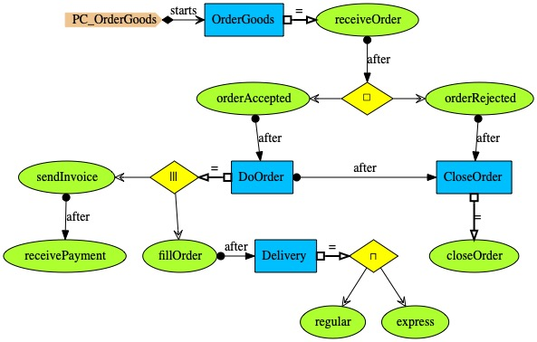

# Order Goods

In the ordering system, <i>PC_OrderGoods</i>, an order is either accepter or rejected after
it has been received; if accepted, the order goes through several stages; filled and rejected orders
must ultimately be closed.

