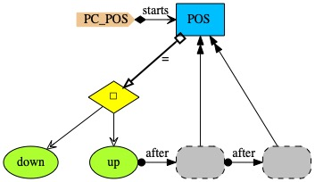

# POS

<i>POS</i> is a process from [Hoa85, p.156]. It accepts any number of <i>downs</i> and <i>ups</i> terminating successfuly when the number of <i>downs</i> exceeds  number of <i>ups</i>.

Above, receiving a <i>down</i> symbol results in the successful end of <i>POS</i>, whereas a <i>up</i> symbol means that <i>POS</i> needs to run twice to ensure that there are more downs than  ups.

### References

[Hoa85] Anthony Hoare. Communicating Sequential Processes. Prentice-Hall International. 1985.
