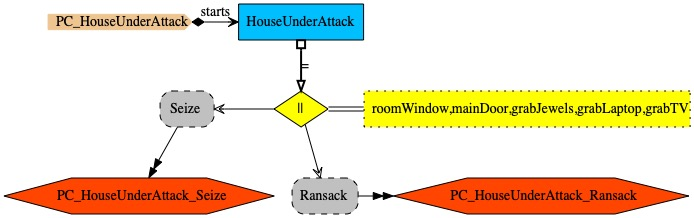

# Threat Surface Modelling and Analysis

A house containing valuables that may be stolen illustrates how PCs can tackle security threat modelling and analysis.

The house has two entrance/exit points: main door and bedroom window. The hall is reached when entering through the main door; from the hall one may reach
living room, bedroom or kitchen, and vice-versa. The window gives access to the bedroom. An attacker may get hold of the living room’s TV, or the bedroom’s laptop or jewellery.

## Modelling the Attack Surface

The PC above describes the attack surface through process <i>HouseUnderAttack</i>, which is defined as the parallel composition of processes <i>Snatch</i> and <i>Ransack</i>; <i>Snatch</i> controls the stolen objects and <i>RanSack</i> describes how someone may go through the house and grab the valuables inside.

In <i>PC_HouseUnderAttack_Ransack</i>, an attacker enters the premises through the entry points. The main door entrance gives access to the hall which is captured by process <i>IntoHall</i>, triggered upon event <i>intoHall</i> (someone reached the hall); the hall gives access to kitchen (event <i>intoKitchen</i>), bedroom (process <i>IntoRoom</i>) and living-room (event <i>intoLivingRoom</i>). The bedroom window entrance gives access to the bedroom.  While <i>InLivingRoom</i>, an attacker may grab hold of the TV, or go back to the hall. While <i>InRoom</i>, an attacker may grab either the laptop or jewellery (an atom which can either be <i>any</i> of the events of the given set), join the hall (reference to <i>IntoHall</i>), or leave the house through the bedroom window (<i>roomWindow</i>).

PC <i>PC_HouseUnderAttack_Snatch</i>,
process <i>Snatch</i> says that an attacker may get into the premises through the entry points. While inside, the attacker may snatch items, corresponding to the events <i>grabTV</i>, <i>grabLaptop</i>, <i>grabJewels</i>, as per process <i>SnatchControl</i>. Snapped items may no longer be snitched again (corresponding event is removed from allowed event set).

## Modelling the Security Defence

PC <i>PC_ProtectedHouse</i> protects the house's attack surface with an alarm. Process <i>ProtectedHouse</i> by describing a parallel composition of processes <i>HouseUnderAttack</i> and <i>HouseAlarm</i> (see below), which synchronise on the events involved in entering in, exiting from, moving in, and snatching items from the premises (<i>intoHall</i>, <i>mainDoor</i>, <i>roomWindow</i>, etc).

PC <i>PC_ProtectedHouse</i> (above) describes the house's alarm, which takes three sets of events: the alarm events <i>aes</i> are those raising the alarm, the gateway events <i>ges</i> through which someone may enter or leave the premises, and the pass events <i>pes</i> which represent the house events ignored by the alarm. The process starts when  someone enters the premises (atom <i>entry</i>, which represents any of the events in set <i>ges</i>), after which the alarm enters a <i>WatchOut</i> mode in which: (i) the occurrence of any of the alarm events raise the alarm (event <i>alarmSounds</i>) and keep it under alert, (ii) pass events are ignored and do not interrupt the alert mode, and (iii) a gateway events signal that the intruder left the premises meaning that the alarm may terminate gracefully.

## Discovering Threats and Vulnerabilities

The defence model described in PC <i>PC_ProtectedHouse</i> (above) raises the following questions: to what extent is the system secure? Are there vulnerabilities in the system? The answer to such questions may lie in the CSP specifications generated from the PCs and their formal reasoning capabilities automated by the CSP tool FDR4. The application of suspicion analysis to a CSP context involves: (i) an abstract model capturing the security expectations of the secured system, (ii) a system model required to be a traces-refinement of the abstract model, (iii) an analysis which looks for security vulnerabilities in the traces identified by the model checker as counter-examples to the security expectation.

PC <i>PC_SecuredHouse</i> above is the abstract model capturing the expectations of a secured house. It defines process <i>SecuredHouse</i> with two parameters: gateway events (<i>ges</i>) and ransack events (<i>res</i>); <i>SecuredHouse</i> says that someone may enter or leave the premises, and then move inside and steal things (compound <i>Ransack</i>), but this will raise the alarm, after which an intruder may do further moving and stealing, and then leave the premises. Process <i>ThisSecuredHouse</i> instantiates <i>SecuredHouse</i> for PC <i>PC_ProtectedHouse</i>. The modelled expectation is that the alarm is raised while moving and stealing inside the premises. The security analysis is distilled into the
the following CSP refinement assertion:
<i>ThisSecuredHouse &#x2291;T ProtectedHouse</i>

This unsatisfied assertion provides a counter-example which highlights a vulnerability: the alarm does not go off when entering and leaving the premises through the window. This insight is translated as the attack described in PC <i>PC_SuccessfulHouseAttack</i> above, which is allowed as <i>ProtectedHouse &#x2291;T SuccessfulHouseAttack</i> is satisfied. This is accepted in the  <i>ProtectedHouse</i> model because the alarm only tracks entries into the hall (see PC <i>PC_ProtectedHouse</i> above). The vulnerability can be fixed by raising the alarm when someone enters the room (through a movement detector placed in the bedroom), or by disallowing room window entries altogether (by barring the window). The two assertions above are included in the file 'PC_SecuredHouse_Analysis.csp', which may be executed in the FDR4 refinement checker tool.
